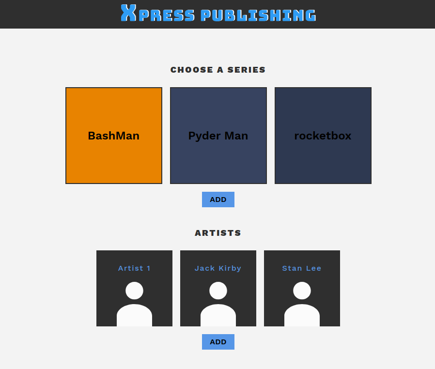
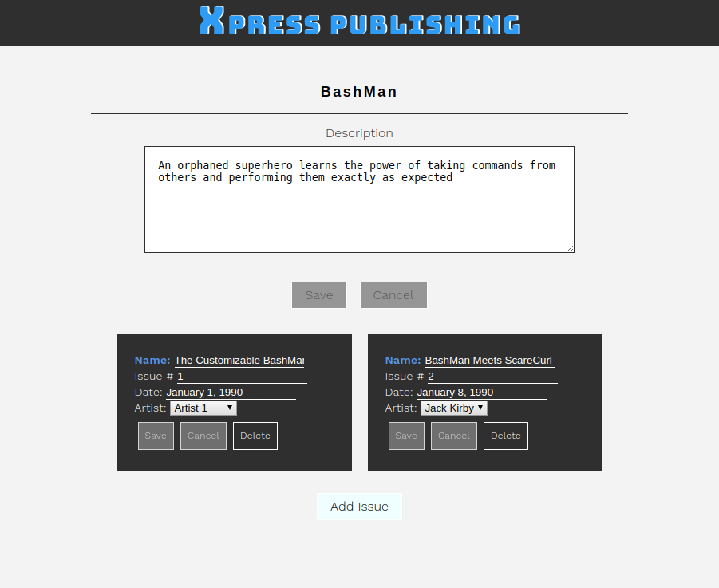
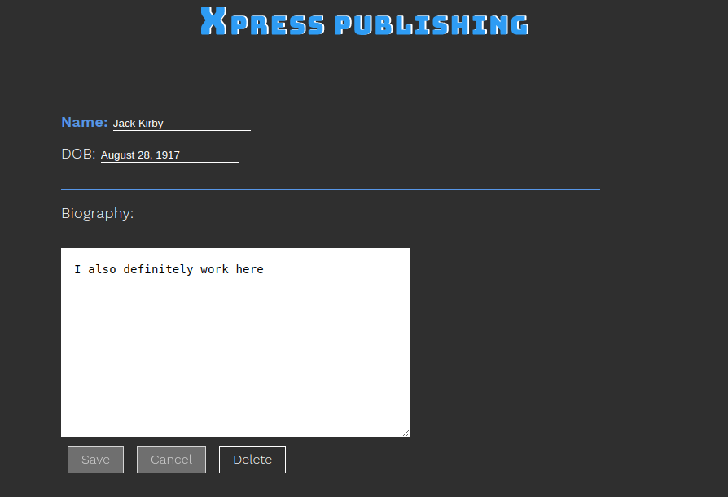

# X-Press Publishing

Building an API using Express.js and SQLite for an internal management tool for a comic book publishing company

## Project Overview

In this project I built the routing and database logic for an internal tool for a comic book publishing company called X-Press Publishing.

The X-Press Publishing internal tool allows users to:
- Create, view, and update artists
- Create, view, update, and delete comic book series
- Create, view, update, and delete issues of a specific comic book series

## To Run

Run `npm install`.
If you would like extra data to interact with, run `node seed.js` to seed the database.
Run `node server.js` to start the server.
Open `index.html` in your browser.

## Testing

To run the testing suite, run `npm run test`. This project is in a completed state and hence all tests pass.

## Additional Images

